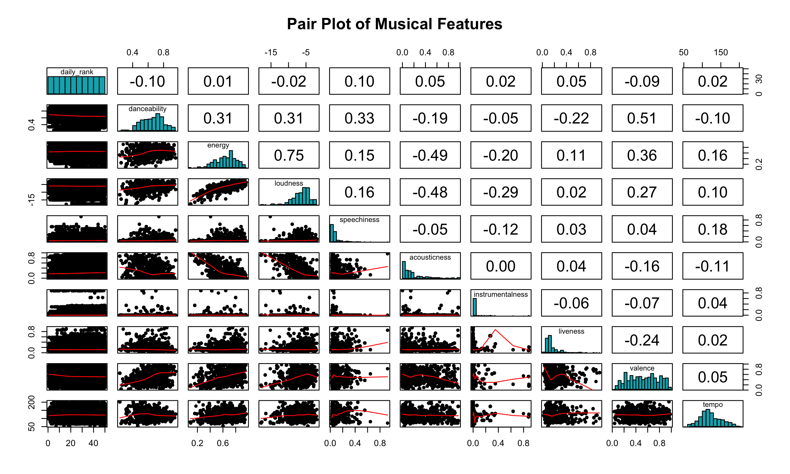

```{r message=TRUE, include=FALSE, results='asis'}
# Loading the necessary libraries
library(readr)
library(dplyr)
library(tidyr)
library(stringr)
library(ggplot2)
library(plotly)
library(car)
library(PMCMRplus)
library(here)
```


# Abstract 


# Introduction

#### **Background** 

Music industry has long been a significant component of entertainment sector. In 2024, Spotify achieves a remarkable milestone by surpassing $9 billion in annual payments to the music industry from any single retailer. As this vibrant ecosystem continues to expand, billions of songs compete for listener attention across diverse audiences. Understanding what makes certain tracks resonate is more critical than ever. 

This study provides a comprehensive analysis of the factors influencing song popularity. By examining how music attributes influence popularity and chart success, exploring regional variations in listener preferences, and identifying temporal patterns in the rise and fall of popularity. Building on these insights, we develop predictive models to forecast a song’s potential success. Ultimately, our findings offer actionable strategies that can help artists, producers, and marketers refine their creative and promotional approaches to achieve better popularity.

#### **Objectives**

Analyze the Influence of Musical Attributes:
To examine how musical features like danceability, energy, tempo, valence, and loudness contribute to the popularity of songs, providing insights into key drivers of listener engagement and chart performance.

Evaluate Factors Impacting Top Rankings:
To determine how specific musical features influence a song's likelihood of reaching the top 25 rankings on global charts, identifying attributes that correlate strongly with chart success.

Understand Regional and Cultural Preferences:
To uncover variations in musical preferences across countries and regions, exploring how cultural and geographic factors shape listener behavior and song performance.

Identify Temporal Patterns in Song Popularity:
To investigate trends in the rise and fall of song popularity over time, analyzing seasonal patterns and the lifespan of popular songs to inform optimal release strategies.


#### **Research questions**

The backbone of our study lies in answering the following SMART questions:

Q1: How do musical attributes like danceability, energy, tempo, valence, and loudness contribute to a song’s popularity?

Q2: How do musical features influence a song's likelihood of reaching the top 25 rankings on global charts?

Q3: How do musical preferences vary across countries and regions?

Q4: What temporal patterns exist in rise and fall of song popularity?

*These SMART questions were developed to identify the key factors driving song popularity and to provide actionable insights into the global music landscape. Each question targets specific elements, such as musical attributes, regional preferences, and temporal trends, aiming to uncover patterns that can inform music producers, marketers, and streaming platforms. The insights generated can help optimize song production strategies, tailor content to regional preferences, and identify the ideal timing for music releases to maximize audience engagement and chart performance.*


# Dataset Overview

This dataset presents the top 50 songs from over 70 countries, as well as global rankings, updated daily from October 18, 2023, to November 20, 2024. The data is sourced from [Kaggle](https://www.kaggle.com/datasets/asaniczka/top-spotify-songs-in-73-countries-daily-updated/data) and is collected by querying the Spotify API each day. This dataset comprises more than 1.4 million song entries and a comprehensive range of features categorized into basic information, temporal features, chart performance, musical attributes, and non-musical attributes.


- __Basic Information__: `name`, `artists`, `album_name`, and  `country`

- __Temporal features__: `snapshot_date`, `album_release_date`

- __Chart Performance__: `daily_rank`, `daily_movement`, `weekly_movement`,`popularity`

- __Musical Attributes__:`danceability`, `energy`, `tempo`, `acousticness`, `valence`, `loudness`, `instrumentalness`, `liveness`, `speechiness`, `key`, `mode`, `time_signature`

- __Non-Musical Attributes__:`is_explicit`, `duration_ms`


# Data Preprocessing

1. Drop columns which are not useful for modelling and have no meaning on the popularity of a song

2. The minimum value of time signature of a song is 0, which is not possible (Remove rows with time signature = 0).

3. According to the data description, NAs in `country` means Global Top 50. Therefore, we will fill NAs with 'Global'.

4. Since the percentage of observations with NAs is relatively low at 0.046% of the observations, we will drop all the other observations with NAs.

# Exploratory Data Analysis


## Research Question 1. 


### Bivariate Analysis and Multivariate Analysis : 


##### Overview of Weather and Lighting Effects:


##### Key Findings:


### **Hypothesis Testing**


### Practical Implications :


## 3. Analysis of Infrastrcture conditions


#### Bivariate Analysis :

#### Multivariate Analysis :

#### **Tests carried out**

#### 1. chi-square test on the effect of road types


## Smart Question 2: How do musical features influence a song's likelihood of reaching the top 25 rankings on global charts?

After analyzing how musical features affect a song's popularity, we shift our focus to another performance metric: daily ranking, specifically within global charts.  Focusing on global rankings helps eliminate regional biases that could confound our predictive model.

### EDA

To prepare the dataset for this question, we first filtered the dataset to include only rankings from global charts. We then created a new columns `top_25`, indicating whether a song falls within top 25 global ranking.



The pair plot of daily rank and various music features does not reveal a clear monotonic relationship.


Top 25 songs tend to have higher `danceability`, `loudness`, `energy`, and lower `acousticness`, suggesting that upbeat, energetic, and less acoustic tracks are more likely to rank highly. Subsequently, we conducted t-tests to check for statistical significance of each musical feature .

__Null Hypothesis__: There is no significant difference in the mean values of the musical feature between the Top 25 and Top 26-50 groups.

__Alternative Hypothesis__: There is a significant difference in the mean values of the musical feature between the Top 25 and Top 26-50 groups.

The t-tests revealed no significant difference in `tempo` and `energy` (p-value < 0.05) between the Top 25 and Top 26-50 groups. However, with p-values < 0.05 for  `loudness`, `speechiness`, `acousticness`, `instrumentalness`, `liveness`,`valence`, `danceability`, we can conclude these features significantly differ between the two groups.

### Model Exploration

In predict whether a song is within the global top 25,we utilized two predictive models: __K-Nearest Neighbor__ and __Logistic Regression__, 

__Logistic Regression__

Logistic regression offers simple interpretation of each variable's effect. We employed backward and forward selection to choose features and checked for multicollinearity using VIF. Variables with VIF > 10 were removed to ensure model stability, and insignificant variables were dropped.


Notably, `danceability` has the strongest positive relationship with higher rankings. The odds of being in the Top 25 increase by approximately 750.5% with each unit increase. `key` and `mode1` all have positive impact association with higher rankings, while `speechiness`, `instrumentalness`, `acousticness`, `loudness` and `liveness` has negative association with higher rankings.

__K Nearest Neighbor (KNN)__

Given the moderate performance metrics of logistic regression, we employed KNN, which is well-suited for binary classification tasks. Data preparation involved converting all variables to numeric types and standardizing them. We built two KNN models one full model and one with music features only. 

We employed two KNN tuning methods using a 3:1 train-test split: manual iterative tuning on the test set and automated cross-validation with the caret package. For the full feature set, both approaches identified k = 3 as optimal. However, for the music-only features, cross-validation favored k = 3 while test set tuning suggested k = 7; considering consistent accuracy and balanced performance, we selected k = 7 as the best model for the music features.

#### Model Evaluation

| **Metric**             | **Logistic Regression** | **KNN (Full Model)** | **KNN (Music Features Only)** |
|-----------------------|-------------------------|-----------------------|-------------------------------|
| **Accuracy**          | 0.6136                  | 0.8475                | 0.7471                        |
| **Precision**         | 0.6216                  | 0.8492                | 0.7535                        |
| **Sensitivity**       | 0.5814                  | 0.8484                | 0.7275                        |
| **Specificity**       | 0.6459                  | 0.8465                | 0.7663                        |
| **F1 Score**          | 0.6008                  | 0.8488                | 0.7402                        |
| **McFadden R2**       | 0.0832                  | N/A                   | N/A                           |

The logistic regression model demonstrates moderate accuracy at 61.4%, with stronger sensitivity compared to weaker specificity. This imbalance suggests that the model is biased towards predicting class 0. An AUC of 0.677 below the 0.8 threshold and a McFadden’s R² of 0.0832 highlight its poor fit. These metrics suggest that alternative modeling techniques should be explored.

In contrast, the KNN full model excels with an accuracy, sensitivity, and specificity each around 85%, and an AUC of 0.913, indicating strong discriminative ability. The KNN model using only music features also performs well, achieving 74.71% accuracy, consistent precision, sensitivity and specificity and an AUC of 0.814. These results demonstrate that KNN models, especially the full model, are highly effective for this dataset.


### Key Findings

Using predictive models-logistical regression and KNN- we can predict whether a song falls within Top 25 or Top 26-50 on global charts based on their musical features.

Logistic regression reveals that energetic and danceable music tends to achieve, while niche qualities like live recordings or high speech content have less universal appeal. KNN with music features shows better performance than logistic regression, and the all features KNN model further enhances performance by incorporating non-musical factors and performance metrics. Overall, KNN outperforms logistic regression, likely due to its ability to capture non-linear relationships between musical features and rank groups, as observed in the EDA.

For future work, ensemble models such as Random Forest or XGBoost could be explored to address KNN’s lack of built-in feature importance. These models could potentially enhance predictive performance by capturing complex interactions


# Conclusion

This project successfully identified key drivers of song popularity on Spotify, providing actionable insights into musical and non-musical attributes. By leveraging advanced modeling techniques and robust data analysis, the study highlighted significant regional and temporal patterns, offering valuable guidance for artists, producers, and marketers. Future work could extend this analysis to incorporate additional data sources and explore emerging trends in the music industry.


