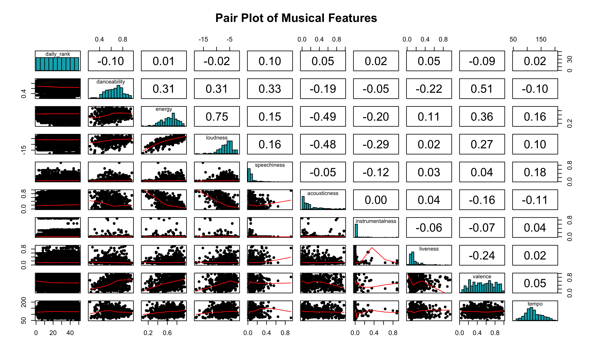

# Introduction

Music industry has always be a a large part of entertainment industry. Spotify hits its record highest annual payments to the the music industry from any single retailer at above $9 billion in 2024. Discover what features drive a song to become populary or having higher rankings is our main objective of this project. We will first be looking how music features (eg. `danceability`, `energy` and so on) affect a song's popularity and ranking. And then the regional effect and finally temporal effect. We aim to provide a comprehensive analysis and modeling to predict a song's popularity and ranking.

# Dataset Overview

The dataset comprises the top 50 songs from over 70 countries, based on global rankings. Data is collected daily by querying the Spotify API for the top 50 songs in each country. This specific dataset is sourced from [Kaggle](https://www.kaggle.com/datasets/asaniczka/top-spotify-songs-in-73-countries-daily-updated/data) and includes a comprehensive range of features categorized into basic information, temporal features, chart performance, musical attributes, and non-musical attributes.

- __Basic Information__: `name`, `artists`, `album_name`, and  `country`

- __Temporal features__: `snapshot_date`, `album_release_date`

- __Chart Performance__: `daily_rank`, `daily_movement`, `weekly_movement`,`popularity`

- __Musical Attributes__:
`danceability`, `energy`, `tempo`, `acousticness`, `valence`, `loudness`, `instrumentalness`, `liveness`, `speechiness`, `key`, `mode`, `time_signature`

- __Non-Musical Attributes__:
`is_explicit`, `duration_ms`

## Smart Question 2: How do musical features influence a song's likelihood of reaching the top 25 rankings on global charts?

After analyzing how musical features affect a song's popularity, we shift our focus to another performance metric: daily ranking, specifically within global charts.  Focusing on global rankings helps eliminate regional biases that could confound our predictive model.

### EDA

To prepare the dataset for this question, we first filtered the dataset to include only rankings from global charts. We then created a new columns `top_25`, indicating whether a song falls within top 25 global ranking.

The pair plot of daily rank and various music features does not reveal a clear monotonic relationship.

Top 25 songs tend to have higher `danceability`, `loudness`, `energy`, and lower `acousticness`, suggesting that upbeat, energetic, and less acoustic tracks are more likely to rank highly. Subsequently, we conducted t-tests to check for statistical significance of each musical feature .

__Null Hypothesis__: There is no significant difference in the mean values of the musical feature between the Top 25 and Top 26-50 groups.
__Alternative Hypothesis__: There is a significant difference in the mean values of the musical feature between the Top 25 and Top 26-50 groups.

The t-tests revealed no significant difference in `tempo` and `energy` (p-value < 0.05) between the Top 25 and Top 26-50 groups. However, with p-values < 0.05 for  `loudness`, `speechiness`, `acousticness`, `instrumentalness`, `liveness`,`valence`, `danceability`, we can conclude these features significantly differ between the two groups.

### Model Exploration

In predict whether a song is within the global top 25,we utilized two predictive models: __K-Nearest Neighbor__ and __Logistic Regression__, 

__Logistic Regression__

Logistic regression offers simple interpretation of each variable's effect. We employed backward and forward selection to choose features and checked for multicollinearity using the Variance Inflation Factor (VIF). Variables with VIF > 10 were removed to ensure model stability, and insignificant variables were dropped.

Notably, `danceability` has the strongest positive relationship with higher rankings. he odds of being in the Top 25 increase by approximately 750.5% with each unit increase. `key` and `mode1` all have positive impact association with higher rankings, while `speechiness`, `instrumentalness`, `acousticness`, `loudness` and `liveness` has negative association with higher rankings.

__K Nearest Neighbor (KNN)__

Given the moderate performance metrics of logistic regression, we employed KNN, which is well-suited for binary classification tasks. Data preparation involved converting all variables to numeric types and standardizing them. We built two KNN models one full model and one with music features only. 

We employed two KNN tuning methods using a 3:1 train-test split: manual iterative tuning on the test set and automated cross-validation with the caret package. For the full feature set, both approaches identified k = 3 as optimal. However, for the music-only features, cross-validation favored k = 3 while test set tuning suggested k = 7; considering consistent accuracy and balanced performance, we selected k = 7 as the best model for the music features.

#### Model Evaluation

| **Metric**           | **Logistic Regression** | **KNN (Full Model)** | **KNN (Music Features Only)** |
|-----------------------|-------------------------|-----------------------|-------------------------------|
| **Accuracy**          | 0.6136                  | 0.8475                | 0.7471                        |
| **Precision**         | 0.6216                  | 0.8492                | 0.7535                        |
| **Sensitivity**       | 0.5814                  | 0.8484                | 0.7275                        |
| **Specificity**       | 0.6459                  | 0.8465                | 0.7663                        |
| **F1 Score**          | 0.6008                  | 0.8488                | 0.7402                        |
| **McFadden R2**       | 0.0832                  | N/A                   | N/A                           |

The logistic regression model demonstrates moderate accuracy at 61.4%, with stronger sensitivity compared to weaker specificity. This imbalance suggests that the model is biased towards predicting class 0. An AUC of 0.677 below the 0.8 threshold and a McFadden’s R² of 0.0832 highlight its poor fit. These metrics suggest that alternative modeling techniques should be explored.

In contrast, the KNN full model excels with an accuracy, sensitivity, and specificity each around 85%, and an AUC of 0.913, indicating strong discriminative ability. The KNN model using only music features also performs well, achieving 74.71% accuracy, consistent precision, sensitivity and specificity and an AUC of 0.814. These results demonstrate that KNN models, especially the full model, are highly effective for this dataset.

### Key Findings

Using predictive models-logistical regression and KNN- we can predict whether a song falls within the upper half (Top 25) or lower half (Top 26-50) of global charts based on their musical features.

Logistic regression reveals that energetic and danceable music tends to be higher up on the rank, while niche qualities like live recordings or high speech content have less universal appeal. KNN with music features shows better performance than logistic regression, and the full-feature KNN model further enhances performance by incorporating non-musical factors (e.g., explicit content, duration, age) and performance metrics (e.g., weekly and daily movement). Overall, k-NN outperforms logistic regression, likely due to its ability to capture non-linear relationships between musical features and rank groups, as observed in the EDA.

Since KNN does not have built-in feature importance, to gain clearer insights into each feature's importance in a non-linear model, we can employ ensemble models like Random Forest or XGBoost Classifier. These models not only provide feature importance scores but also enhance predictive performance by capturing complex interactions between features.

# Bibliography

Asaniczka. (2024). Top Spotify Songs in 73 Countries (Daily Updated) [Data set]. Kaggle. https://doi.org/10.34740/KAGGLE/DSV/10210621

Aurelie.Corinthios@groupsjr.com. (2024, March 19). The biggest takeaways from Spotify’sannual Music Economics Report — Spotify. Spotify.
   https://newsroom.spotify.com/2024-03-19/loud-clear-music-streaming-royalty-data-artst-payments/

   